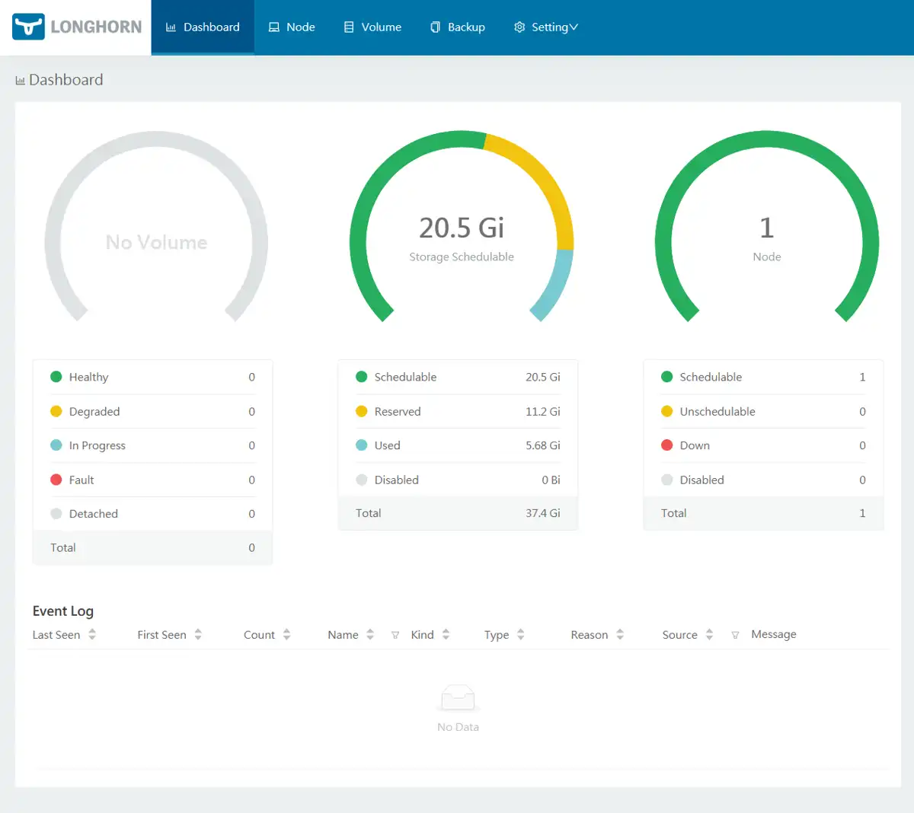

# Persistant storage with localstorage and longhorn
See [k3s storage docs](https://rancher.com/docs/k3s/latest/en/storage/) for more documentation.

Below we will show two options. **Local storage** and **distributed storage**. That just means using the local storage on the node where it is running. On a single machine this is of course not a problem, but it can cause problems if you have a permanent failure of a node in a cluster, where you of course will suffer data loss. On a distributed storage on the other hand, you can make sure that the data is replicated on multiple nodes, and in that case a single node failure would be no problem.


## Local storage
### Local storage PVC
```bash 
cat pvc-ghost-localstorage.yaml | envsubst | kubectl apply -f -
```

### Ghost with persistant local storage
```bash 
cat ghost-localstorage.yaml | envsubst | kubectl apply -f -
```

## Distributed storage (Longhorn)

### Longhorn PVC
```bash 
cat pvc-ghost-longhorn.yaml | envsubst | kubectl apply -f -
```
### Ghost with Longhorn distributed storage
* first delete ghost
```bash 
cat ghost-localstorage.yaml | envsubst | kubectl delete -f -
```
* And then recreate it with longhorn
```bash 
cat ghost-longhorn.yaml | envsubst | kubectl apply -f -
```

## Longhorn UI
```bash 
cat longhorn-ui-ingress.yaml | envsubst | kubectl apply -f -
```

Your longhorn UI should now be accessible at <a href="https://longhorn.dog.example.com" target="_blank">https://longhorn.dog.example.com</a>
